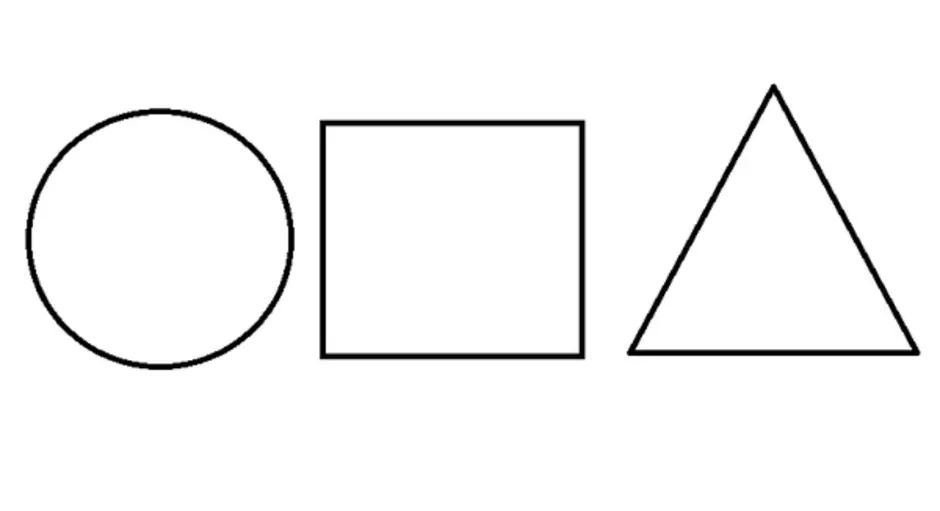
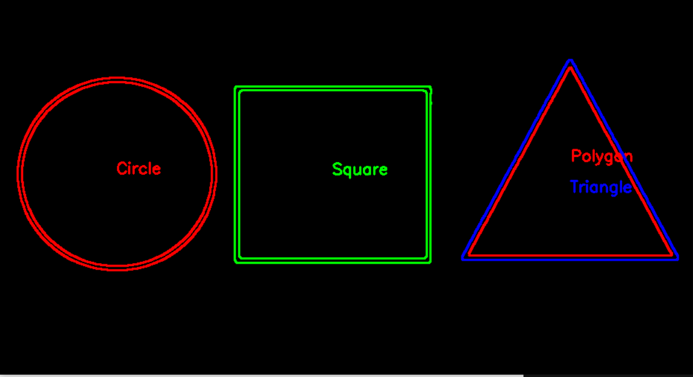

# Детектирование и классификация геометрических фигур на изображении

## 1. Постановка задачи
Программа предназначена для автоматического обнаружения и классификации геометрических фигур на изображении. Она выполняет следующие задачи:
- Загрузка изображения.
- Увеличение насыщенности для улучшения видимости фигур.
- Преобразование изображения в градации серого.
- Обнаружение границ с помощью алгоритма Canny.
- Поиск контуров фигур.
- Классификация фигур (треугольник, квадрат, прямоугольник, круг, многоугольник).
- Визуализация результатов с подписью типов фигур.

## 2. Описание функций

### `detectShape(const std::vector<cv::Point> &contour)`
Функция определяет тип фигуры по её контуру:
- **Входные данные**: Вектор точек контура.
- **Выходные данные**: Строка с названием фигуры ("Triangle", "Square", "Rectangle", "Circle", "Polygon").

### `main()`
Основная функция программы:
1. Загружает изображение `image.png`.
2. Преобразует изображение в цветовое пространство HSV.
3. Увеличивает насыщенность (канал S) для улучшения видимости фигур.
4. Использует канал Value (V) для получения grayscale-изображения.
5. Применяет размытие по Гауссу для уменьшения шума.
6. Обнаруживает границы с помощью алгоритма Canny.
7. Находит контуры фигур.
8. Классифицирует фигуры и отображает их на изображении с подписями.

## 3. Результат
### Оригинал:

### Обработка:
